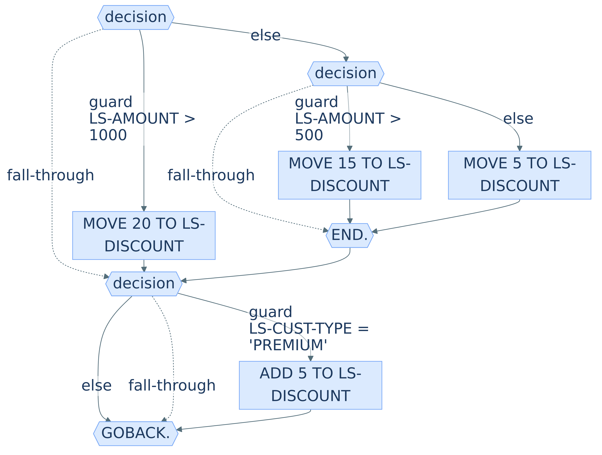
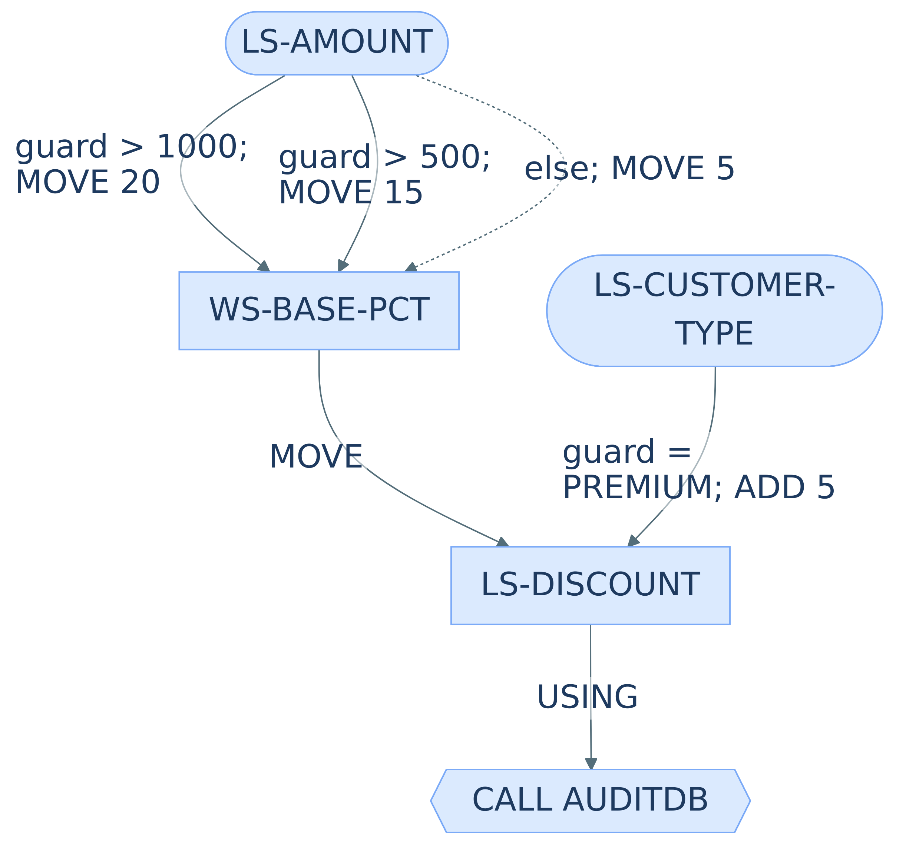
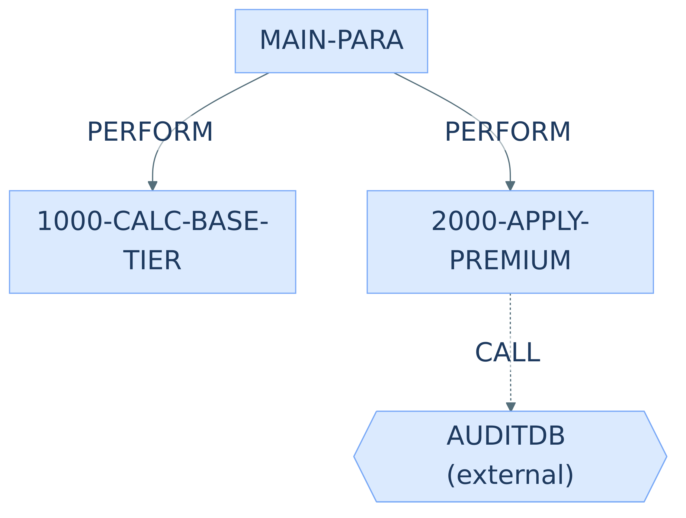
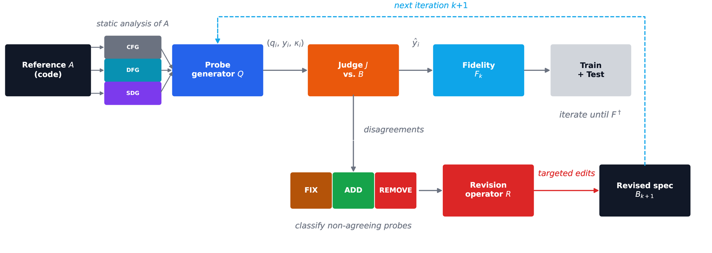
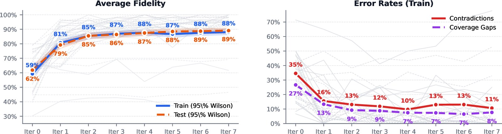
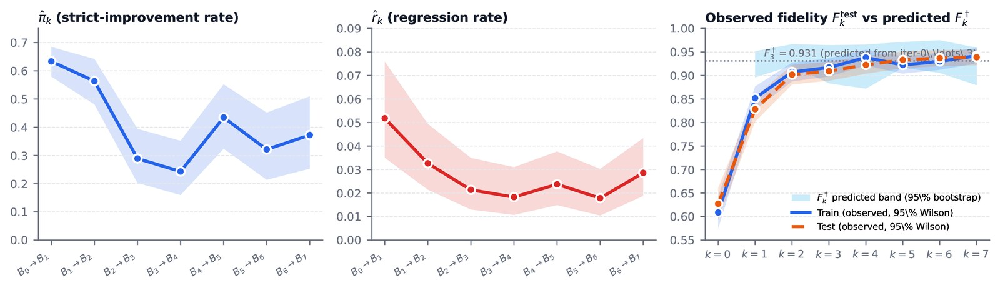

*Companion post to the preprint: [arxiv.org/abs/2605.17246](https://arxiv.org/abs/2605.17246).*

When you modernize a mainframe, the first deliverable is almost never code — it's a natural-language **specification** that a downstream engineering team will build against. Every design decision, test plan, and acceptance criterion after that point is written *against that spec*. So if the spec is silent on a behaviour the COBOL actually implements, or confidently describes a behaviour it does not, those mistakes quietly propagate through the entire programme and surface as production incidents after cut-over.

Catching them after the fact is expensive. Catching them in the spec, before engineering starts, is cheap.

This post is about **fidelity probes** — a small, loud diagnostic for the gap between a program and its specification — and the statistical machinery that makes them trustworthy rather than vibes-based.

## A taste of the setup

The loop juggles three artifacts: the **source code**, a set of **behavioural requirements** (the candidate specification), and the **three symbolic projections** the CFG/DFG/SDG channels sample from. Here's `CALCDISC`, a paragraph-structured variant of a small discount routine adapted from AWS CardDemo:

<div class="essay-panels">

<div class="panel">
<h4>COBOL source (1/2)</h4>

```cobol
IDENTIFICATION DIVISION.
PROGRAM-ID. CALCDISC.
DATA DIVISION.
WORKING-STORAGE SECTION.
01 WS-BASE-PCT  PIC 9(3).
LINKAGE SECTION.
01 LS-AMOUNT        PIC 9(7)V99.
01 LS-DISCOUNT      PIC 9(3).
01 LS-CUSTOMER-TYPE PIC X(10).
PROCEDURE DIVISION USING LS-AMOUNT
    LS-DISCOUNT LS-CUSTOMER-TYPE.
MAIN-PARA.
  PERFORM 1000-CALC-BASE-TIER.
  PERFORM 2000-APPLY-PREMIUM.
  CALL 'AUDITDB' USING LS-DISCOUNT.
  GOBACK.
```

</div>

<div class="panel">
<h4>COBOL source (2/2)</h4>

```cobol
1000-CALC-BASE-TIER.
  EVALUATE TRUE
    WHEN LS-AMOUNT > 1000
      MOVE 20 TO WS-BASE-PCT
    WHEN LS-AMOUNT > 500
      MOVE 15 TO WS-BASE-PCT
    WHEN OTHER
      MOVE 5  TO WS-BASE-PCT
  END-EVALUATE.
  MOVE WS-BASE-PCT TO LS-DISCOUNT.

2000-APPLY-PREMIUM.
  IF LS-CUSTOMER-TYPE = 'PREMIUM'
    ADD 5 TO LS-DISCOUNT
  END-IF.
```

</div>

<div class="panel">
<h4>Behavioural requirements</h4>

**REQ-DISC-001** — When the order amount is *strictly greater than 1,000*, the system *shall* apply a base discount of **20%**.

**REQ-DISC-002** — When the order amount is *strictly greater than 500 and at most 1,000*, the system *shall* apply a base discount of **15%**.

**REQ-DISC-003** — When the order amount is *500 or less*, the system *shall* apply a base discount of **5%**.

**REQ-DISC-004** — When the customer is a **premium member**, the system *shall* add an additional **5 percentage points** on top of whichever base discount applies under REQ-DISC-001–003.

**REQ-AUDIT-001** — Every computed discount *shall* be forwarded to the audit subsystem.

</div>

</div>

<div class="essay-panels essay-panels--graphs" style="grid-template-columns: 0.40fr 0.30fr 0.28fr;">

<figure class="panel">

<figcaption>Control-flow graph (after <code>PERFORM</code> inlining)</figcaption>
</figure>

<figure class="panel">

<figcaption>Field-level data-flow graph</figcaption>
</figure>

<figure class="panel">

<figcaption>System-dependence graph — solid edges are intra-program <code>PERFORM</code>, dashed are inter-program <code>CALL</code></figcaption>
</figure>

</div>

*Real CardDemo programs are an order of magnitude more tangled — `PERFORM … THRU`, fall-through between paragraphs, `GO TO`, nested `EVALUATE`, `COPY`-book expansion — which is exactly why graph-grounded probes pay rent.*

## The workflow

<figure class="post-figure">

<figcaption>The fidelity-probe loop. A reference program is statically analysed; a probe generator emits Q&A pairs whose answers can be read off the code; a judge answers the same questions from the candidate spec; per-probe verdicts (agree / contradict / gap) drive a revision operator that emits targeted edits until the loop reaches its fidelity fixed point.</figcaption>
</figure>

## The probe

A probe is the simplest thing we could think of. It's a natural-language **question** whose ground-truth answer can be read off the code, paired with a judge that tries to answer the same question using only the specification.

- If the specification answers correctly → **agree**.
- If it answers something else → **contradict**.
- If it is silent → **coverage gap**.

Aggregate the outcomes and you get the **fidelity** score $F$ — the agreement rate. Two failure decompositions, contradiction rate $c$ and gap rate $g$, fall out for free, and each one points at a different kind of spec edit: fix a wrong requirement, add a missing one, remove a spurious one.

Five probes from `CBACT02C` (a card-file batch reader, larger than the `CALCDISC` toy above) give the flavour. Each row pairs a question whose answer is mechanically determinable from the COBOL with the actual code evidence the static-analysis pipeline pulled to back the answer:

| Category | Question | Answer (from code) | Code evidence |
|---|---|---|---|
| Output | What is the primary business function of this batch program? | Reads all card records from the card data file sequentially and outputs each card record. | `PERFORM UNTIL END-OF-FILE = 'Y' … DISPLAY CARD-RECORD … END-PERFORM.` |
| Computation | In what order are card records processed and output? | Sequential order based on the card number key. | `SELECT CARDFILE-FILE … ORGANIZATION IS INDEXED … RECORD KEY IS FD-CARD-NUM` |
| Boundary | What happens if the card data file is empty? | Opens the file, attempts to read the first record, encounters end-of-file immediately, outputs no records, and closes normally. | `OPEN INPUT CARDFILE-FILE` → `1000-CARDFILE-GET-NEXT` → `IF APPL-EOF MOVE 'Y' TO END-OF-FILE` |
| Branching | What happens when end-of-file is reached during processing? | The program stops reading further records and proceeds to close the file normally. No error is raised. | `IF CARDFILE-STATUS = '10' MOVE 16 TO APPL-RESULT … IF APPL-EOF MOVE 'Y' TO END-OF-FILE` |
| Negative | Does the program modify or update any card records in the file? | No. The program only reads the card data file; it does not write, update, or delete any records. | `OPEN INPUT CARDFILE-FILE` (input-only mode; no `WRITE` or `REWRITE` anywhere) |

The judge tries to answer the same question using only the modernization spec; the gap between the two is what fidelity measures. Because probes ride on code-derived ground truth, they are i.i.d. samples from a probe distribution $\mathcal{D}_A$ — and that i.i.d.-ness is what lets us do statistics: concentration bounds, a fixed-point prediction for where the loop converges, and a frozen-test protocol that actively falsifies bad generators.

## Where probes come from

We define the probe distribution as a two-level mixture:

$$
\mathcal{D}_A^{\mathrm{sym}} = \beta_{\mathrm{cfg}}\mathcal{D}^{\mathrm{cfg}} + \beta_{\mathrm{dfg}}\mathcal{D}^{\mathrm{dfg}} + \beta_{\mathrm{sdg}}\mathcal{D}^{\mathrm{sdg}}
$$

$$
\mathcal{D}_A(\alpha, \beta) = \alpha\,\mathcal{D}_A^{\mathrm{llm}} + (1-\alpha)\,\mathcal{D}_A^{\mathrm{sym}}
$$

One channel is a **pure LLM** reading the code and asking questions about it. The other three are **symbolic** — deterministic samplers over graphs a static-analysis pipeline extracts from the source:

| Channel | The question the channel uniquely asks |
|---|---|
| Control-flow graph (CFG) | *What observable effect follows when condition $X$ holds?* (guard) |
| Data-flow graph (DFG) | *Which input, under what transformation, produces observable output $Y$?* (data) |
| System-dependence graph (SDG) | *After event $X$, what happens next (screen, output, handoff)?* (flow) |

The mixture parameter $\alpha$ lets you dial from pure-LLM ($\alpha = 1$) to pure-symbolic ($\alpha = 0$); $\beta$ balances between the three symbolic channels.

## The headline number

On 15 programs from AWS CardDemo (≈12k lines of COBOL), the pure-LLM regime raises **frozen-test fidelity from 0.63 to 0.94** over eight iterations. Three graph-grounded mixtures lift that by another **+16 to +30 points**.

<figure class="post-figure">

<figcaption>Average fidelity (left) and error-rate decomposition (right) across 15 programs over eight iterations. Train (solid) vs frozen test (dashed), 95% Wilson bands, per-program traces in grey. The two stubborn low-plateau traces are the outliers (<code>CBACT01C</code>, <code>CORPT00C</code>) — both diagnosed in the paper's appendix.</figcaption>
</figure>

Thirteen of fifteen programs converge to fidelity $\ge 0.80$ by iteration 4; two outliers (`CBACT01C`, `CORPT00C`) plateau lower for reasons we diagnose separately in the paper.

Two pieces of theory make the headline number trustworthy:

1. **A Markov fixed-point prediction.** Model the per-probe state ∈ {agree, contradict, gap} as a two-state recursion with contradiction-repair rate $r$ and coverage-add rate $\pi$. The fidelity converges to
$$F^\dagger = \frac{\pi}{\pi + r}$$
out-of-sample from **four iterations of rate data** — and our measured plateau sits within 1 pp of $F^\dagger$ on three held-out iterations. This is what it looks like to have a non-trivial theoretical prediction about an LLM-in-the-loop system that actually lands.

<figure class="post-figure">

<figcaption>Per-transition Markov rates. Left and middle: strict-improvement rate <em>π̂</em> and regression rate <em>r̂</em> across the seven transitions, with 95% Wilson bands. <em>r̂</em> stays uniformly low (≤ 5%); the loop's revision operator does not systematically regress held probes. Right: observed train (solid) and frozen-test (dashed) fidelity against the predicted <em>F</em><sup>†</sup> band fitted from the first four iterations of rate data — the prediction lands within ~1pp on the three held-out iterations.</figcaption>
</figure>

2. **A Hoeffding-bounded overfitting discriminant.** Re-sample probes on a frozen held-out split. If the train/test gap grows faster than the Hoeffding envelope $\sqrt{\log(2/\delta) / 2n}$, the generator is overfitting to its own critiques. In a five-lineage sweep (Anthropic, DeepSeek, Google, Alibaba, OpenAI), the discriminant actively **falsified** two generators whose probe distributions drifted across iterations. This is the opposite of what most iterative-refinement papers offer: instead of a scalar that always goes up, we ship the rule that tells you when to stop trusting the scalar.

## Related work

Three lines of prior work bear directly on this problem. What each leaves open is what we tried to address.

**Formal verification.** Tools like [Lean](https://leanprover.github.io), [Dafny](https://dafny.org), and [TLA⁺](https://lamport.azurewebsites.net/tla/tla.html) can prove bit-level equivalence between code and spec — but they require both artifacts to be lifted into the prover's logic, *and* the surrounding environment (databases, external services, the CICS and batch runtime, file-system semantics) to be axiomatized. That's feasible for small self-contained modules. It's intractable for a 300k-line mainframe application that talks to an ecosystem with no mechanized specification anywhere. We treat the code as ground truth directly and measure agreement probabilistically, avoiding the lifting step entirely.

**Test-based validation.** Unit and integration tests check a spec against finitely many concrete inputs. They catch what they happen to exercise but cannot surface what the spec is silent about — which turns out to be the most common failure mode in practice. Our loop uses Q&A pairs rather than input/output pairs, so a coverage gap in the spec (the judge returns $\bot$) is a first-class verdict rather than an invisible omission.

**Iterative LLM-driven artifact refinement.** [Self-Refine](https://arxiv.org/abs/2303.17651) and [Reflexion](https://arxiv.org/abs/2303.11366) apply the "generate — critique — revise" loop to freeform text and agent trajectories. Clover and Wybe push the pattern toward code and spec generation. These works demonstrate the viability of the loop, but don't articulate the statistical properties that make its measurements trustworthy: there's no train/test separation, no analysis of whether the improvement metric is overfit to the critique prompts, and no convergence result relating per-iteration progress to a limit. We address all three.

## Why it matters

What we wanted to build, in the end, was not a metric that always goes up. We wanted a number with **three properties**: a known limit, a discriminant that fires when the loop is lying to you, and an actionable decomposition into "what kind of spec edit should I make next." Fidelity, contradiction, and coverage-gap rates give you those three properties from the same measurement.

If that sounds like scaffolding rather than a product, it is. But it's the scaffolding you need before you can seriously claim a spec is ready for engineering to build against — especially in a mainframe-modernization programme where the cost of shipping an incorrect spec is measured in quarters, not sprints.
