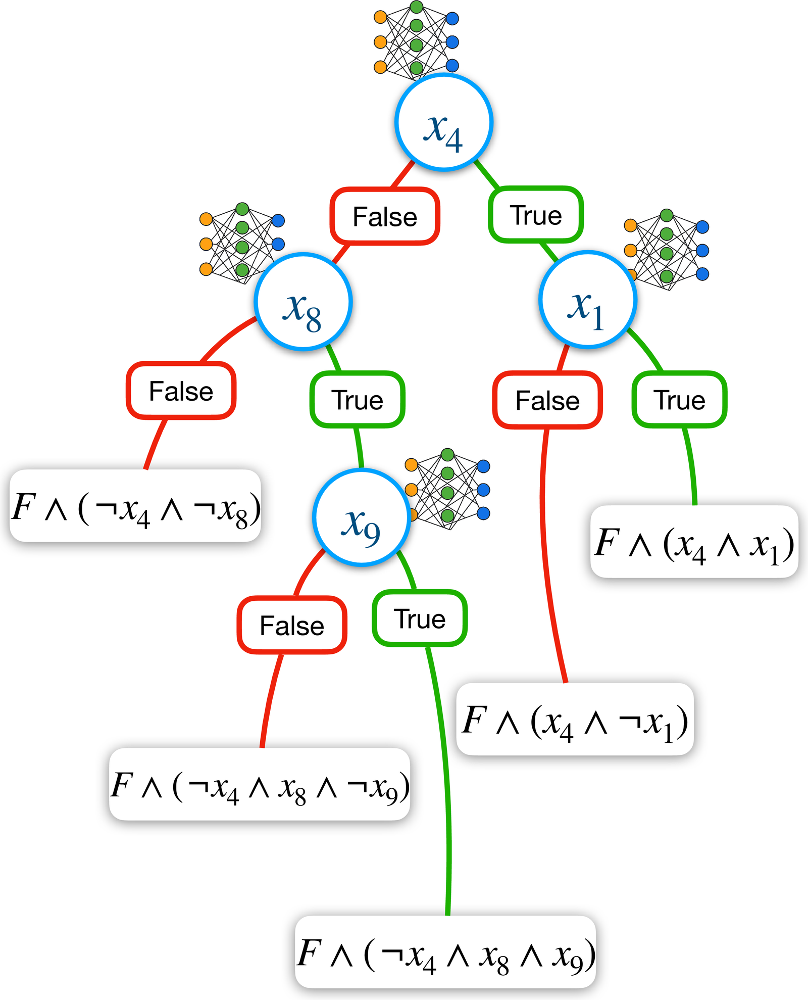
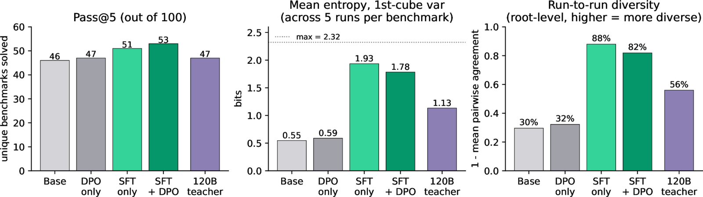
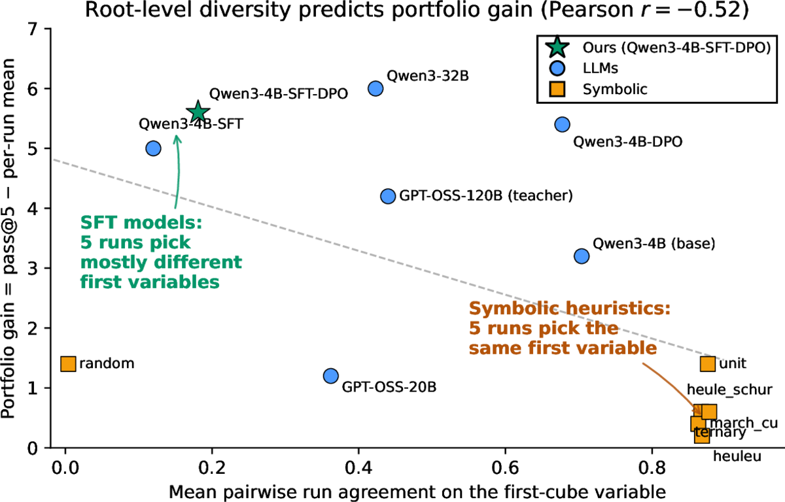

*Companion post to the preprint: [arxiv.org/abs/2605.16632](https://arxiv.org/abs/2605.16632).*

A 4B-parameter transformer can learn to split SAT formulas well enough to match the best symbolic cubing heuristic, beat frontier LLMs a hundred times its size, and do it on the 100 hardest problems from recent SAT competitions. That's the headline from our NeurIPS 2026 submission, *Learning How to Cube*. I want to write about why that result is more interesting than it sounds — what it suggests is possible once you stop treating "neural" and "symbolic" as competing teams.

## The setup, briefly

Propositional satisfiability (SAT) is the oldest NP-complete problem and one of the most practically useful: program verification, hardware design, planning, and — increasingly — automated reasoning inside LLM pipelines all reduce to SAT underneath. The state-of-the-art way to solve genuinely hard SAT instances is **Cube-and-Conquer**: first partition the formula into thousands of subproblems ("cubes"), then hand each cube to a Conflict-Driven Clause Learning (CDCL) solver in parallel. It's how [the Pythagorean triples conjecture was finally resolved in 2016](https://www.nature.com/articles/534017a) — a 200-terabyte proof produced by one of the largest C&C runs ever attempted.

The method lives or dies on the **cubing heuristic** — the rule that picks which variable to split on at each node of the cube tree. For thirty years this has been a purely symbolic craft: VSIDS, Jeroslow-Wang, march-cu, heule-schur, heuleu. Every major SAT solver ships its own hand-tuned variant. The job description sounds exactly like something a transformer should be good at: read a large Boolean formula, recognise structure, predict which variable will split it most cleanly. And yet no transformer-based architecture had ever been shown to do this well. Prior learned heuristics (LRB, NeuroCore, AlphaMapleSAT) used GNNs or bandit-style policies, not language models; the one paper that tried a transformer directly on SAT reasoning found significant limitations. Our submission closes that gap.

<figure class="panel"><figcaption>(a) Cube-and-Conquer with a learned cubing heuristic. At each node, the transformer picks a splitting variable; the two resulting subformulas become new cubes, each solved independently by a parallel CDCL rollout.</figcaption></figure><figure class="panel panel--algorithm"><pre class="algorithm"><code>Input:  node n, heuristic heur
Output: run statistics

 1 (v, ¬v)       ← Choose-Split(n, heur)
 2 (cn₁, cn₂)    ← Create-Children(n, (v, ¬v))
 3 stats₁        ← Rollout(cn₁)           // child 1
 4 if stats₁.sat_status = UNKNOWN:
 5    cube_stats₁ ← Cube-and-Conquer(cn₁, heur)
 6    merge(stats₁, cube_stats₁)
 7 Return-If-Timeout(cube_stats₁)
 8 stats₂ ← ∅                               // child 2
 9 if stats₁.sat_status ≠ SAT:
10    stats₂ ← Rollout(cn₂)
11    if stats₂.sat_status = UNKNOWN:
12       cube_stats₂ ← Cube-and-Conquer(cn₂, heur)
13       merge(stats₂, cube_stats₂)
14 cube_stats ← combine(stats₁, stats₂)
15 return cube_stats</code></pre><figcaption>(b) Evaluation loop. Choose-Split is the cubing phase (heuristic-picked variable), Rollout is the conquering phase (Glucose v4.2 CDCL with a 5-second timeout). End-to-end budget is 30 minutes per benchmark. Cubing and solving are interleaved — the next split is conditioned on the previous rollout's outcome.</figcaption></figure>

## What the result actually says

The numbers (pass@5 over 100 held-out competition benchmarks, 5 runs each, 30-minute timeout per run):

| Heuristic | pass@5 |
|---|---|
| Random baseline | 43 |
| Qwen3-4B (untrained base) | 46 |
| GPT-OSS-20B | 42 |
| GPT-OSS-120B | 47 |
| Claude Sonnet 3.7 / 4 | 48 / 50 |
| march-cu (symbolic) | 52 |
| **unit (best symbolic)** | **53** |
| **Qwen3-4B-SFT-DPO (ours)** | **53** |

A 4B model ties the strongest symbolic heuristic and surpasses every frontier LLM we tested. That's the surface story. The more interesting story is underneath.

## What SFT does that nobody quite expected

We trained in two stages: **supervised fine-tuning (SFT)** on teacher-generated reasoning traces, then **direct preference optimisation (DPO)** on MCTS-curated preference pairs grounded in real solver statistics. Our headline ablation is disciplined: SFT alone takes the base model from 46 → 51 pass@5; DPO adds 2 more benchmarks (51 → 53).

But the per-run variance tells a deeper story. Symbolic heuristics are nearly deterministic: `unit` averages 51.6 solved per run and `pass@5` is 53 — almost no gain from multiple attempts. Our model averages 47.4 per run and reaches 53 on pass@5. A 5.6-benchmark gap between per-run mean and pass@5. **The model is finding different answers on different runs, and those different answers cover different regions of the problem space.** That's a portfolio effect, not a noise effect.

To confirm this wasn't a generic LLM property, we measured first-cube Shannon entropy across 5 runs per benchmark on seven baselines:

| Heuristic | Entropy (bits) | Pairwise run agreement |
|---|---|---|
| Deterministic symbolic | 0.22–0.25 | 86–88 % |
| Untrained Qwen3-4B | 0.55 | 70 % |
| DPO-only (no SFT) | 0.59 | 68 % |
| **Qwen3-4B-SFT** | **1.93** | **12 %** |
| Qwen3-4B-SFT-DPO (ours) | 1.78 | 18 % |
| 120B teacher | 1.13 | 44 % |

The untrained base model and the DPO-only ablation are behaviourally indistinguishable from deterministic symbolic heuristics at the root — they commit to the same first split almost every time. **SFT is the thing that flips the model into a qualitatively different regime**, a regime of *calibrated exploration* where different runs genuinely probe different parts of the decision space but every probe is still competent. DPO on top trades a small amount of diversity (1.93 → 1.78 bits) for two extra benchmarks solved.

<figure class="post-figure">

<figcaption>Stage ablation across the four 4B training stages (base, DPO-only, SFT-only, SFT+DPO) with the 120B teacher shown for reference. Pass@5 climbs steadily; entropy and run-to-run diversity jump at the SFT stage and survive DPO. The student exceeds its teacher on every axis.</figcaption>
</figure>

<figure class="post-figure">

<figcaption>Across all 13 heuristics in the study, first-cube run-agreement and portfolio gain (pass@5 − per-run mean) are negatively correlated at Pearson <em>r</em> = −0.52. The diversity-to-coverage link is not a quirk of our model — it shows up cleanly across symbolic heuristics, frontier LLMs, and our SFT/DPO ablations.</figcaption>
</figure>

This is subtle. The community has spent a lot of 2024–2025 debating whether RLHF/DPO-style methods *reduce* entropy and make models overconfident. Our mechanistic analysis says: yes, DPO does compress decision diversity a bit — but only after SFT has first *expanded* it. The sequence matters. And the 4B student ends up more exploratory than its 120B teacher on every axis, which suggests something interesting about how post-training on domain-specific preference pairs can *increase* effective task diversity relative to the teacher.

Across all 13 heuristics we tested, first-cube agreement and pass@5 gain are negatively correlated at Pearson $r = -0.52$. The diversity-to-coverage link is not a quirk of our model.

## Why this matters beyond SAT

Three reasons, in order of how much they generalise.

**1. SAT is an honest testbed for neural-symbolic hybrids.** Most neural-symbolic papers benchmark on curated datasets where you can always hand-wave about distribution shift. SAT competition benchmarks are adversarial by construction: the community publishes the problems that existing solvers *can't* handle. You can't overfit to the test set because the test set was designed to embarrass you. A 4B model matching `unit` on hard SAT is a cleaner credential than matching symbolic solvers on synthetic 3-SAT. It also means the headroom above our result is principled — the 34 problems nobody solves in under 24 hours of CDCL are the same 34 problems our model doesn't solve, because the whole field is stuck there.

**2. The portfolio argument is bigger than cubing.** The neural heuristic solves two benchmarks `unit` cannot; `unit` solves two our model cannot. Running both and unioning the outputs (a classic SAT portfolio, à la SATzilla) costs you 2× wall-clock and buys measurable coverage above either alone. Portfolios are not a new idea in SAT — but what *is* new is having a learnable, tuneable member of the portfolio whose exploration profile you can *dial* by choosing where on the SFT–DPO continuum you stop training. Every existing portfolio member is a fixed lookup. Ours is a parameterised family.

**3. The SFT-unlocks-diversity phenomenon is a research direction.** Why does supervised fine-tuning on teacher reasoning traces produce a model that is *more* exploratory than the teacher, even though SFT nominally just distils the teacher's distribution? One possibility is that the teacher's traces are themselves sampled at temperature, and SFT reconstructs the distribution over reasoning paths rather than any single path. Another is that the diversity of SAT-solving strategies in the teacher's traces exceeds what any single inference call can expose. I don't think we know yet. But the fact that this is *measurable* — via entropy and per-run agreement, not vibes — means it is *studiable*. There's a decent chance this is not specific to SAT; it would be surprising if a similar mechanism didn't exist for code-generation, theorem proving, or any domain where the task admits multiple valid solution strategies.

## The near-term potential

Three things I think are within reach:

- **A learned heuristic inside a production solver.** Nothing in our setup prevents hosting a small model behind a gRPC endpoint that a Glucose-derived CDCL solver queries at each cube. The decision latency is the barrier — right now our 4B model makes fewer total splits per 30 minutes than `unit` does — but 4B is the *upper* bound of what you need; it's plausible a 500M-parameter distilled student with aggressive speculative decoding could be *faster* than `unit` and still competitive.
- **Portfolio-aware training objectives.** If diversity is what pays rent, you can optimise for it directly: train several small models with decorrelated reasoning traces (different teacher prompts, different data subsets, different DPO reference models), and run them as a portfolio. The theoretical framework for when this helps is well-understood in ensemble learning but has barely been applied to neural-symbolic systems.
- **Cubing heuristics for SMT and constraint solvers.** The same setup should transfer: MCTS-curated preference data, SFT-then-DPO, teacher reasoning traces. SMT is a less mature space for learned heuristics than SAT, and the stakes are higher because SMT drives most modern formal verification.

## What I find most striking

Cubing looks like a purely combinatorial problem. It is phrased in the language of clauses and literals, and every existing top heuristic reads the formula like a mathematician would. We trained a model on natural-language *explanations* of good cubing choices — the reasoning traces are English sentences about variable frequency, clause balance, unit propagation potential — and that model, at 4B parameters, makes splitting decisions that are competitive with thirty years of hand-crafted symbolic craft.

What the model seems to have learned is not a new heuristic, but a *meta-heuristic* — the judgement to pick which of several known strategies fits this particular formula. Our post-hoc classification shows the model's reasoning traces distribute across the classical heuristic categories (VSIDS frequency analysis, Jeroslow-Wang clause weighting, balanced splitting, polarity balance) at ratios that shift with formula structure. Two human experts independently labelled a sample; Cohen's $\kappa$ between them was 0.37, between them and the LLM judge 0.45 and 0.48. The field has known for a while that no single heuristic dominates — that's why portfolio solvers work at all. What was missing was a unit that could *select between heuristics in context*. It looks like a 4B transformer can be that unit.

That is, to me, the real news. Not that neural matches symbolic. That neural and symbolic belong in the same loop.
